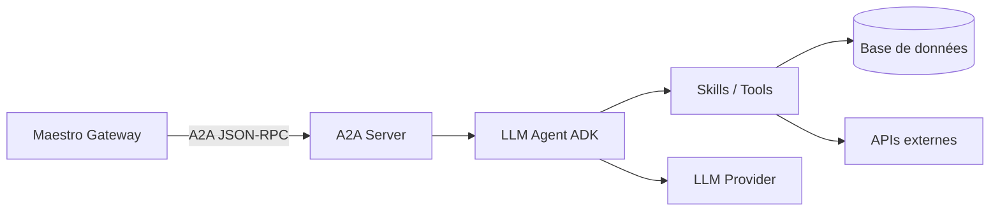

# {EMOJI} {NOM_AGENT} — {TITRE_COURT}

> **Rôle** : {Description en une phrase du domaine métier de cet agent.}
> **Port** : `{PORT}` · **Protocole** : JSON-RPC 2.0 (A2A) · **Type** : Serveur A2A spécialisé

---

## 📋 Présentation

{Paragraphe décrivant le périmètre métier de cet agent. En tant que serveur A2A indépendant, il est isolé des autres agents et ne communique qu'avec Maestro (ou tout client A2A compatible).}

### Périmètre métier

- {Capacité métier 1}
- {Capacité métier 2}
- {Capacité métier 3}

### Ce que cet agent ne fait PAS

- {Limite explicite — ex : ne gère pas les recettes (→ Gourmet)}
- {Limite explicite}

---

## 🏗️ Architecture interne



### Modules

| Fichier | Rôle |
|---|---|
| `main.py` | {Description — ex : Serveur A2A, configuration, lifespan} |
| `agent.py` | {Description — ex : Définition de l'agent ADK, skills, prompt} |
| `schemas.py` | {Description — ex : Modèles Pydantic métier} |
| `instruction.md` | {Description — ex : Prompt LLM spécialisé pour le domaine} |
| `Dockerfile` | {Description — ex : Build multi-stage pour déploiement conteneurisé} |

---

## 🎯 Skills A2A exposées

> Ces skills constituent le **contrat A2A** de cet agent — ce que Maestro peut lui demander.

| Skill | Description | Paramètres |
|---|---|---|
| `{skill_name}` | {Description de la compétence} | {Paramètres attendus} |
| `{skill_name}` | {Description de la compétence} | {Paramètres attendus} |

### Format JSON-RPC (exemple)

```json
{
  "jsonrpc": "2.0",
  "method": "message/send",
  "params": {
    "message": {
      "role": "user",
      "parts": [{"text": "{exemple de requête typique}"}],
      "messageId": "uuid"
    }
  },
  "id": "req-001"
}
```

---

## 🚀 Lancement local (standalone)

### Prérequis

- Python ≥ 3.13
- `uv` (gestionnaire de paquets)
- Variables d'environnement configurées (voir ci-dessous)

### Démarrage

```bash
# Depuis la racine du projet
uv run uvicorn src.{module_name}.main:app --port {PORT} --reload
```

> **Note :** Cet agent fonctionne de manière autonome. Il n'a besoin d'aucun autre agent pour démarrer.

---

## ⚙️ Variables d'environnement

| Variable | Description | Défaut |
|---|---|---|
| `OPENROUTER_API_KEY` | Clé API pour le LLM (via LiteLLM/OpenRouter) | _(requis)_ |
| `DEFAULT_MODEL` | Modèle LLM utilisé | `openrouter/google/gemini-2.0-flash-001` |
| `DATABASE_URL` | Connexion PostgreSQL (si applicable) | `postgresql+asyncpg://...` |
| `DEBUG` | Mode debug (logs verbeux) | `false` |

---

## 🌐 Endpoints

> 📖 Documentation interactive complète : **[Swagger UI](http://localhost:{PORT}/docs)**

| Méthode | Route | Description |
|---|---|---|
| `POST` | `/` | Point d'entrée A2A (JSON-RPC 2.0) |
| `GET` | `/.well-known/agent.json` | Agent Card (découverte A2A) |
| `GET` | `/health` | État de santé |

---

## 🧪 Tests

```bash
# Lancer les tests de cet agent
PYTHONPATH=. uv run pytest tests/{module_name}/ -v

# Avec couverture
PYTHONPATH=. uv run --with pytest-cov pytest tests/{module_name}/ --cov=src.{module_name} --cov-report=term-missing
```

### Périmètre de tests

- {Catégorie 1 — ex : Logique métier (scénarios nominaux, cas limites)}
- {Catégorie 2 — ex : Serveur A2A (réception JSON-RPC, Agent Card)}
- {Catégorie 3 — ex : Skills / Tools (mocks LLM, validation Pydantic)}

---

## 🐳 Docker

```bash
# Build standalone
docker build -f src/{module_name}/Dockerfile -t tegmen-{agent_name} .

# Run
docker run -p {PORT}:{PORT} --env-file .env tegmen-{agent_name}
```

---

## 🔧 Troubleshooting

| Problème | Cause probable | Solution |
|---|---|---|
| `ModuleNotFoundError` | `PYTHONPATH` non configuré | Lancer depuis la racine avec `PYTHONPATH=.` |
| Agent Card non servie | Mauvais path pour `agent.json` | Vérifier le montage du fichier statique |
| Réponse LLM vide | Clé API invalide ou quota dépassé | Vérifier `OPENROUTER_API_KEY` et les logs |
