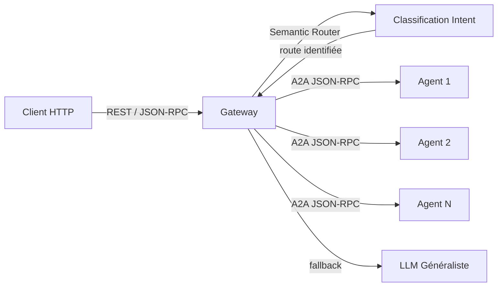

# 🎹 {NOM_AGENT} — {TITRE_COURT}

> **Rôle** : {Description en une phrase du rôle de cet agent dans l'écosystème Tegmen.}
> **Port** : `{PORT}` · **Protocole** : JSON-RPC 2.0 (A2A) · **Type** : Gateway / Client A2A

---

## 📋 Présentation

{Paragraphe décrivant la responsabilité de cet agent. En tant que Gateway, il ne traite aucune logique métier — il analyse l'intention utilisateur et délègue aux agents spécialisés via le protocole A2A.}

### Responsabilités clés

- {Responsabilité 1}
- {Responsabilité 2}
- {Responsabilité 3}

### Ce que cet agent ne fait PAS

- {Limite explicite — ex : ne gère pas la persistance métier}
- {Limite explicite}

---

## 🏗️ Architecture interne



### Modules

| Fichier | Rôle |
|---|---|
| `main.py` | {Description — ex : Application FastAPI, lifespan, CORS, endpoints} |
| `router.py` | {Description — ex : Semantic Router, classification d'intention} |
| `agents.py` | {Description — ex : Registre des agents, mapping route → agent} |
| `schemas.py` | {Description — ex : Modèles Pydantic (requêtes/réponses)} |
| `instruction.md` | {Description — ex : Prompt LLM pour le fallback généraliste} |
| `Dockerfile` | {Description — ex : Build multi-stage pour déploiement conteneurisé} |

---

## 🔀 Topologie des agents downstream

| Agent | Route sémantique | URL par défaut | Description |
|---|---|---|---|
| {agent_1} | `{route_name}` | `http://localhost:{port}` | {Description courte} |
| {agent_2} | `{route_name}` | `http://localhost:{port}` | {Description courte} |
| {agent_n} | `{route_name}` | `http://localhost:{port}` | {Description courte} |
| _(fallback)_ | `unknown` | _(local)_ | {Description du fallback LLM} |

---

## 🚀 Lancement local (standalone)

### Prérequis

- Python ≥ 3.13
- `uv` (gestionnaire de paquets)
- Variables d'environnement configurées (voir ci-dessous)

### Démarrage

```bash
# Depuis la racine du projet
uv run uvicorn src.{module_name}.main:app --port {PORT} --reload
```

### Mode Microservices

```bash
# Active le routage vers les agents distants via A2A
MICROSERVICES_MODE=true uv run uvicorn src.{module_name}.main:app --port {PORT}
```

---

## ⚙️ Variables d'environnement

| Variable | Description | Défaut |
|---|---|---|
| `OPENROUTER_API_KEY` | Clé API pour le LLM (via LiteLLM/OpenRouter) | _(requis)_ |
| `DEFAULT_MODEL` | Modèle LLM utilisé pour le fallback | `openrouter/google/gemini-2.0-flash-001` |
| `EMBEDDING_MODEL` | Modèle d'embedding pour le routeur sémantique | `sentence-transformers/all-MiniLM-L6-v2` |
| `MICROSERVICES_MODE` | Active le routage A2A vers les agents distants | `false` |
| `{AGENT}_URL` | URL de chaque agent downstream | `http://localhost:{port}` |
| `DEBUG` | Mode debug (logs verbeux LiteLLM) | `false` |

---

## 🌐 Endpoints

> 📖 Documentation interactive complète : **[Swagger UI](http://localhost:{PORT}/docs)**

| Méthode | Route | Tag | Description |
|---|---|---|---|
| `GET` | `/health` | System | État de santé du gateway |
| `POST` | `/api/v1/routing` | Gateway | Point d'entrée A2A (JSON-RPC 2.0) |
| `GET` | `/routes` | System | Liste des agents disponibles |
| `POST` | `/chat` | Legacy | Ancien endpoint REST _(dépréciation prévue)_ |

---

## 🧪 Tests

```bash
# Lancer les tests de cet agent
PYTHONPATH=. uv run pytest tests/{module_name}/ -v

# Avec couverture
PYTHONPATH=. uv run --with pytest-cov pytest tests/{module_name}/ --cov=src.{module_name} --cov-report=term-missing
```

### Périmètre de tests

- {Catégorie 1 — ex : Classification sémantique (routes connues, edge cases, fallback)}
- {Catégorie 2 — ex : Endpoints REST (validation Pydantic, codes HTTP)}
- {Catégorie 3 — ex : Routage A2A (mocks, timeouts, erreurs réseau)}

---

## 🐳 Docker

```bash
# Build standalone
docker build -f src/{module_name}/Dockerfile -t tegmen-{agent_name} .

# Run
docker run -p {PORT}:{PORT} --env-file .env tegmen-{agent_name}
```

---

## 🔧 Troubleshooting

| Problème | Cause probable | Solution |
|---|---|---|
| `ModuleNotFoundError` | `PYTHONPATH` non configuré | Lancer depuis la racine avec `PYTHONPATH=.` |
| Timeout A2A | Agent downstream inaccessible | Vérifier que l'agent cible tourne sur le bon port |
| Routage `unknown` systématique | Modèle d'embedding non chargé | Vérifier `EMBEDDING_MODEL` et la connectivité réseau au premier lancement |
