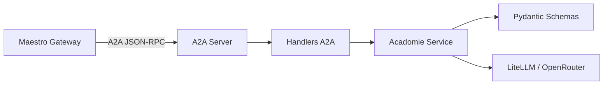

# 🎓 Agent Acadomie — Assistant Scolaire

> **Rôle** : Assistant spécialisé dans la gestion de la vie scolaire (devoirs, calendrier, notes) et l'aide à l'organisation.
> **Port** : `8002` · **Protocole** : JSON-RPC 2.0 (A2A) · **Type** : Serveur A2A spécialisé (Architecture Lean)

---

## 📋 Présentation

L'**Agent Acadomie** est un microservice du système Tegmen dédié au suivi académique de la famille. Il permet de centraliser les informations scolaires et de fournir des conseils d'organisation personnalisés. En tant que serveur A2A "Lean", il est stateless et reçoit son contexte (identité, historique) directement dans les requêtes de Maestro.

### Périmètre métier

- **Gestion des Devoirs** : Consultation et ajout des tâches scolaires.
- **Calendrier Scolaire** : Suivi des examens, vacances et événements scolaires.
- **Suivi des Notes** : Consultation sécurisée des résultats par matière.
- **Conseils d'Organisation** : Aide à la planification des révisions et à la gestion du temps.

### Ce que cet agent ne fait PAS

- Ne gère pas la cuisine ou les recettes (→ Gourmet).
- Ne gère pas la logistique des voyages ou sorties complexes (→ Explorer).

---

## 🏗️ Architecture interne



### Modules

| Fichier | Rôle |
|---|---|
| `main.py` | Point d'entrée, configuration FastAPI et montage du serveur A2A. |
| `app/api/routers/a2a.py` | Handlers JSON-RPC et dispatching des méthodes A2A. |
| `app/schemas/` | Contrats Pydantic stricts pour la validation des données. |
| `app/services/` | Logique métier et interactions avec les sources de données ou LLM. |
| `app/context.py` | Gestion du contexte asynchrone (correlation_id). |
| `app/logger.py` | Logging structuré au format JSON. |

---

## 🎯 Skills A2A exposées

| Skill | Description |
|---|---|
| `homework` | Consulter ou ajouter des devoirs scolaires. |
| `calendar` | Consulter les événements du calendrier scolaire. |
| `grades` | Consulter les notes par matière. |
| `organization` | Obtenir des conseils d'organisation et de révision. |

### Format JSON-RPC (exemple)

```json
{
  "jsonrpc": "2.0",
  "method": "message/send",
  "params": {
    "message": {
      "role": "user",
      "parts": [{"text": "Quels sont mes devoirs pour demain ?"}],
      "messageId": "uuid"
    },
    "context": {
        "correlation_id": "cid-123",
        "family_id": "fam-456"
    }
  },
  "id": "req-001"
}
```

---

## 🚀 Lancement local (standalone)

### Prérequis

- Python ≥ 3.13
- `uv` (gestionnaire de paquets)

### Démarrage

```bash
# Depuis la racine du projet
uv run uvicorn src.agent_acadomie.main:app --port 8002 --reload
```

---

## ⚙️ Variables d'environnement

| Variable | Description | Défaut |
|---|---|---|
| `OPENROUTER_API_KEY` | Clé API pour le LLM | _(requis)_ |
| `DEFAULT_MODEL` | Modèle LLM utilisé | `google/gemini-2.0-flash-001` |
| `DEBUG` | Mode debug (logs verbeux) | `false` |

---

## 🌐 Endpoints

| Méthode | Route | Description |
|---|---|---|
| `POST` | `/a2a/SendMessage` | Point d'entrée A2A (JSON-RPC 2.0) |
| `GET` | `/a2a/AgentCard` | Agent Card (métadonnées et skills) |
| `GET` | `/health` | État de santé de l'agent |

---

## 🧪 Tests

```bash
# Lancer les tests de cet agent
uv run pytest tests/agent_acadomie/ -v
```

---

## 🐳 Docker

L'agent est intégré au `docker-compose.yml` racine.

```bash
# Lancer l'agent acadomie
docker compose --profile acadomie up
```
