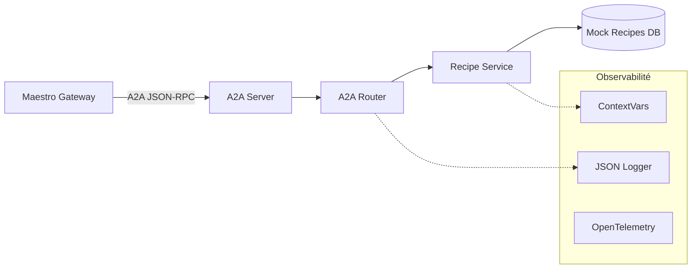

# 🍳 Agent Gourmet — Expert en Cuisine et Recettes

> **Rôle** : Microservice spécialisé dans la recherche de recettes, l'extraction de détails culinaires et l'assistance à la planification de repas.
> **Port** : `8001` (externe) / `8000` (interne) · **Protocole** : JSON-RPC 2.0 (A2A) · **Type** : Serveur A2A Lean

---

## 📋 Présentation

L'Agent Gourmet est le pilier culinaire de l'écosystème Tegmen. Il gère une base de données de recettes familiale et expose des capacités de recherche avancée et d'extraction de détails via le protocole A2A (Agent-to-Agent). Contrairement aux agents ADK classiques, Gourmet utilise une **Architecture Lean** sans dépendance directe à un orchestrateur LLM pour ses fonctions de base, garantissant performance et fiabilité (Fail-Fast).

### Périmètre métier

- **Recherche multicritères** : Filtrage par mots-clés, tags (végétarien, rapide, etc.), temps de préparation et exclusion d'ingrédients.
- **Consultation détaillée** : Extraction complète des ingrédients (quantités structurées) et des étapes de préparation.
- **Interface Chat A2A** : Support de la méthode `message/send` pour une intégration naturelle dans le flux de discussion Maestro.

### Ce que cet agent ne fait PAS

- **Gestion des stocks** : Ne gère pas l'inventaire du frigo (→ Agent Explorer).
- **Planification scolaire** : Ne gère pas les devoirs (→ Agent Acadomie).

---

## 🏗️ Architecture interne



### Modules

| Fichier | Rôle |
|---|---|
| `main.py` | Point d'entrée FastAPI, montage de l'application A2A et définition de l'Agent Card. |
| `app/api/routers/a2a.py` | Handlers JSON-RPC (search, get_details, message/send) et gestion du contexte. |
| `app/services/recipe_service.py` | Logique métier de recherche et filtrage, gestion des timeouts et délais artificiels. |
| `app/context.py` | Gestion du `correlation_id` et extraction des traces OTel via `contextvars`. |
| `app/logger.py` | Logger JSON structuré avec masquage automatique des données sensibles (Zero-Trust). |
| `app/schemas/recipe.py` | Modèles Pydantic pour la validation stricte des entrées/sorties. |

---

## 🎯 Skills A2A exposées

> Ces skills constituent le **contrat A2A** de cet agent — ce que Maestro peut lui demander.

| Skill | Description | Paramètres |
|---|---|---|
| `search_recipes` | Recherche de recettes avec filtres avancés. | `query`, `tags_include`, `tags_exclude`, `ingredients_exclude`, `max_prep_time`, `limit`, `offset` |
| `get_recipe_details` | Récupère les détails complets d'une recette. | `recipe_id` |
| `message/send` | Point d'entrée chat pour dispatcher les requêtes textuelles. | `message` (Objet A2A Message) |

### Format JSON-RPC (exemple : Recherche)

```json
{
  "jsonrpc": "2.0",
  "method": "search_recipes",
  "params": {
    "query": "carbonara",
    "tags_include": ["italien"],
    "context": {
      "correlation_id": "req-123-abc"
    }
  },
  "id": "1"
}
```

---

## 🚀 Lancement local (standalone)

### Prérequis

- Python ≥ 3.13
- `uv` (gestionnaire de paquets)
- Variables d'environnement (optionnel pour le mode mock)

### Démarrage

```bash
# Depuis la racine du projet Tegmen
uv run uvicorn src.agent_gourmet.main:app --port 8001 --reload
```

---

## ⚙️ Variables d'environnement

| Variable | Description | Défaut |
|---|---|---|
| `GOURMET_PERSISTENCE_TIMEOUT_MS` | Timeout strict pour les opérations de "persistance" | `3000` |
| `GOURMET_ARTIFICIAL_DELAY_MS` | Latence artificielle pour chaos testing | `0` |
| `OTEL_ENABLED` | Activation des traces OpenTelemetry | `true` |
| `DEBUG` | Mode logs verbeux (toujours format JSON) | `false` |

---

## 🧪 Tests

L'Agent Gourmet dispose d'une couverture de test exhaustive (Resilience, Observabilité, Business Logic).

```bash
# Lancer tous les tests Gourmet
uv run pytest tests/agent_gourmet/ -v

# Tester spécifiquement la résilience (chaos testing)
uv run pytest tests/agent_gourmet/test_gourmet_resilience.py
```

### Périmètre de tests

- **Résilience** : Validation des timeouts et de la gestion de la latence.
- **Observabilité** : Vérification de la propagation du `correlation_id` et du format JSON des logs.
- **Logique Métier** : Validation Pydantic, filtrage complexe et pagination.

---

## 🐳 Docker

L'agent est intégré au `docker-compose.yml` racine.

```bash
# Lancer uniquement Gourmet (avec la DB partagée)
docker compose --profile gourmet up -d
```

---

## 🔧 Observabilité & Debug

Gourmet implémente les standards de production Tegmen :
1. **Correlation ID** : Présent dans chaque log et chaque réponse d'erreur.
2. **Traces** : Intégration OpenTelemetry (le `trace_id` est inclus dans les erreurs JSON-RPC).
3. **Structured Logs** : Logs au format JSON pour une ingestion facile par ELK/Loki.
4. **Zero-Trust Logging** : Les données textuelles (PII) sont masquées ou exclues des logs.
