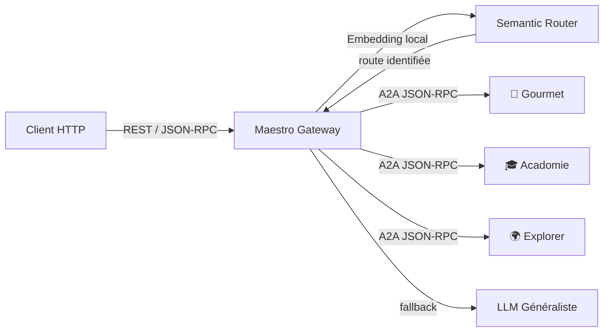

# 🎹 Maestro — Family Agents Gateway

> **Rôle** : Point d'entrée unique de l'écosystème Tegmen. Analyse l'intention utilisateur par routage sémantique et délègue aux agents spécialisés via le protocole A2A.
> **Port** : `8000` · **Protocole** : JSON-RPC 2.0 (A2A) · **Type** : Gateway / Client A2A

---

## 📋 Présentation

Maestro est le **cerveau de triage** de la famille d'agents Tegmen. Il ne possède aucune expertise métier propre — son rôle est d'écouter l'utilisateur, de comprendre son intention grâce à un routeur sémantique (basé sur `semantic-router` et `sentence-transformers`), puis de transmettre la requête à l'agent spécialisé compétent via le protocole A2A (JSON-RPC 2.0).

En cas d'intention non classifiable, Maestro dispose d'un **fallback LLM généraliste** (via Google ADK + LiteLLM) capable de répondre aux questions générales de la famille.

### Responsabilités clés

- **Classification sémantique** des intentions utilisateur (sans consommer de tokens LLM)
- **Routage A2A** vers les agents spécialisés (Gourmet, Acadomie, Explorer)
- **Fallback généraliste** pour les requêtes hors périmètre des agents domaine
- **Exposition de l'API REST/JSON-RPC** pour le client web

### Ce que cet agent ne fait PAS

- Aucune logique métier (cuisine, école, voyage) — déléguée aux agents domaine
- Aucune persistance de données métier — chaque agent gère son propre stockage
- Aucun appel direct aux APIs externes — c'est la responsabilité des agents spécialisés

---

## 🏗️ Architecture interne



### Modules

| Fichier | Rôle |
|---|---|
| `main.py` | Application FastAPI — lifespan, CORS, endpoints REST et JSON-RPC |
| `router.py` | Routeur sémantique — classification d'intention via embeddings locaux |
| `agents.py` | Registre des agents — mapping route → instance `LlmAgent` (ADK) |
| `schemas.py` | Modèles Pydantic — `ChatRequest`, `ChatResponse`, `HealthResponse` |
| `instruction.md` | Prompt LLM pour le fallback généraliste (ne pas confondre avec de la doc développeur) |
| `Dockerfile` | Build multi-stage (`uv` builder → Python slim runtime) |

---

## 🔀 Topologie des agents downstream

| Agent | Route sémantique | URL par défaut | Description |
|---|---|---|---|
| 🍳 Gourmet | `gourmet` | `http://localhost:8001` | Cuisine, recettes, menus, listes de courses |
| 🎓 Acadomie | `acadomie` | `http://localhost:8002` | École, devoirs, calendrier scolaire |
| 🌍 Explorer | `explorer` | `http://localhost:8003` | Voyages, sorties, activités familiales |
| 🎹 _(fallback)_ | `unknown` / `chitchat` | _(local)_ | Questions générales, salutations, smalltalk |

---

## 🚀 Lancement local (standalone)

### Prérequis

- Python ≥ 3.13
- `uv` (gestionnaire de paquets)
- Variables d'environnement configurées (voir ci-dessous)

### Démarrage (mode monolithe)

```bash
# Depuis la racine du projet
uv run uvicorn src.agent_maestro.main:app --port 8000 --reload
```

> ⚠️ En mode monolithe, Maestro charge les agents localement — les modules `agent_gourmet`, `agent_acadomie` et `agent_explorer` doivent être accessibles dans le `PYTHONPATH`.

### Démarrage (mode microservices)

```bash
# Active le routage vers les agents distants via A2A
MICROSERVICES_MODE=true uv run uvicorn src.agent_maestro.main:app --port 8000
```

En mode microservices, chaque agent doit tourner sur son port respectif. Maestro communiquera avec eux via HTTP/JSON-RPC.

---

## ⚙️ Variables d'environnement

| Variable | Description | Défaut |
|---|---|---|
| `OPENROUTER_API_KEY` | Clé API pour le LLM fallback (via LiteLLM/OpenRouter) | _(requis)_ |
| `DEFAULT_MODEL` | Modèle LLM utilisé par le fallback généraliste | `openrouter/google/gemini-2.0-flash-001` |
| `EMBEDDING_MODEL` | Modèle d'embedding pour le routeur sémantique | `sentence-transformers/all-MiniLM-L6-v2` |
| `MICROSERVICES_MODE` | Active le routage A2A vers les agents distants | `false` |
| `GOURMET_URL` | URL de l'agent Gourmet | `http://localhost:8000` |
| `ACADOMIE_URL` | URL de l'agent Acadomie | `http://localhost:8000` |
| `EXPLORER_URL` | URL de l'agent Explorer | `http://localhost:8000` |
| `DEBUG` | Mode debug (logs verbeux LiteLLM) | `false` |

---

## 🌐 Endpoints

> 📖 Documentation interactive complète : **[Swagger UI](http://localhost:8000/docs)**

| Méthode | Route | Tag | Description |
|---|---|---|---|
| `GET` | `/health` | System | État de santé du gateway |
| `POST` | `/api/v1/routing` | Gateway | Point d'entrée principal A2A (JSON-RPC 2.0) |
| `GET` | `/routes` | System | Liste des agents disponibles et leurs URLs |
| `POST` | `/chat` | Legacy | Ancien endpoint REST _(dépréciation prévue au profit de `/api/v1/routing`)_ |

---

## 🧪 Tests

```bash
# Lancer les tests du Maestro
PYTHONPATH=. uv run pytest tests/agent_maestro/ -v

# Avec couverture
PYTHONPATH=. uv run --with pytest-cov pytest tests/agent_maestro/ --cov=src.agent_maestro --cov-report=term-missing
```

### Périmètre de tests

- **Classification sémantique** : routes correctes pour chaque domaine, gestion du fallback `unknown`, cas limites (messages ambigus, vides)
- **Endpoints REST** : validation Pydantic, codes HTTP (200, 422, 500), format JSON-RPC
- **Routage A2A** : appels mockés vers les agents distants, gestion des timeouts et erreurs réseau

---

## 🐳 Docker

```bash
# Build standalone
docker build -f src/agent_maestro/Dockerfile -t tegmen-maestro .

# Run
docker run -p 8000:8000 --env-file .env tegmen-maestro
```

---

## 🔧 Troubleshooting

| Problème | Cause probable | Solution |
|---|---|---|
| `ModuleNotFoundError: agent_maestro` | `PYTHONPATH` non configuré | Lancer depuis la racine avec `PYTHONPATH=.` ou `uv run` |
| `ModuleNotFoundError: agent_gourmet` | Mode monolithe sans les agents installés | Passer en `MICROSERVICES_MODE=true` ou vérifier la structure `src/` |
| Timeout A2A vers un agent | Agent downstream inaccessible | Vérifier que l'agent cible tourne et que `{AGENT}_URL` est correct |
| Routage `unknown` systématique | Modèle d'embedding non chargé | Vérifier `EMBEDDING_MODEL` et la connectivité réseau (premier téléchargement) |
| Swagger UI vide | Imports cassés au démarrage | Consulter les logs `uvicorn` pour identifier l'erreur d'import |
